# 📋 **README.md - Goals App**

## 🎯 **Acerca del Proyecto**

**Goals App** es una aplicación web moderna para la gestión de metas y tareas personales, construida con **Laravel 10** y **Vue 3 + Inertia.js**. Ofrece una experiencia de usuario fluida con un dashboard dinámico, sistema de progreso basado en tareas y URLs seguras con hash IDs.

## ✨ **Características Principales**

### 🎯 **Gestión de Metas**
- ✅ Crear, editar y eliminar metas personales
- ✅ Asignar descripciones y fechas límite
- ✅ Sistema de progreso automático basado en tareas

### 📋 **Gestión de Tareas**
- ✅ Crear tareas asociadas a metas
- ✅ Marcar tareas como completadas
- ✅ Eliminar tareas individualmente
- ✅ Ordenamiento automático de tareas

### 📊 **Dashboard Dinámico**
- ✅ Estadísticas en tiempo real (total, completadas, en progreso)
- ✅ Mensajes motivacionales personalizados
- ✅ Visualización de metas destacadas
- ✅ Conteo de rachas de productividad

### 🔒 **Seguridad**
- ✅ Sistema de autorización con Laravel Policies
- ✅ Hash IDs para evitar enumeración de URLs
- ✅ Protección CSRF
- ✅ Validación de inputs en frontend y backend

## 🛠️ **Stack Tecnológico**

### **Backend**
- **Laravel 10** - Framework PHP
- **PHP 8.5** - Lenguaje de programación
- **SQLite** - Base de datos (configurable a MySQL/PostgreSQL)
- **Laravel Policies** - Sistema de autorización

### **Frontend**
- **Vue 3** - Framework JavaScript
- **Inertia.js** - Bridge entre Laravel y Vue
- **Tailwind CSS** - Framework de estilos
- **Atomic Design** - Arquitectura de componentes

### **Herramientas**
- **Composer** - Gestor de paquetes PHP
- **NPM/PNPM** - Gestor de paquetes JavaScript
- **Vite** - Herramienta de build
- **Git** - Control de versiones

## 🚀 **Instalación**

### **Prerrequisitos**
- PHP >= 8.1
- Composer
- Node.js >= 16
- NPM o PNPM

### **Pasos de Instalación**

```bash
# 1. Clonar el repositorio
git clone <repository-url>
cd goals-app

# 2. Instalar dependencias de PHP
composer install

# 3. Instalar dependencias de JavaScript
npm install
# o
pnpm install

# 4. Configurar entorno
cp .env.example .env
php artisan key:generate

# 5. Configurar base de datos
# Editar .env con tu configuración de BD

# 6. Ejecutar migraciones
php artisan migrate

# 7. Iniciar servidor de desarrollo
php artisan serve
npm run dev
```

## 📁 **Estructura del Proyecto**

```
goals-app/
├── app/
│   ├── Http/Controllers/     # Controladores Laravel
│   ├── Models/              # Modelos Eloquent
│   ├── Services/            # Lógica de negocio
│   ├── DTOs/                # Data Transfer Objects
│   └── Http/Requests/       # Form Requests
├── resources/
│   ├── js/
│   │   ├── Pages/           # Páginas Vue
│   │   ├── Components/      # Componentes UI
│   │   └── Composables/     # Lógica reutilizable
│   └── views/               # Blade templates
├── database/
│   ├── migrations/          # Migraciones de BD
│   └── seeders/             # Datos de prueba
├── routes/                  # Rutas de la aplicación
└── public/                  # Assets públicos
```

## 🎨 **Arquitectura Frontend**

### **Atomic Design**
- **Atoms**: Componentes básicos (botones, inputs)
- **Molecules**: Combinaciones de atoms (formularios, cards)
- **Organisms**: Componentes complejos (dashboards, listas)
- **Templates**: Layouts de página
- **Pages**: Páginas completas

### **Composables**
- `useTaskManagement` - Gestión de tareas
- `useTaskProgress` - Cálculo de progreso
- `useGoals` - Gestión de metas

## 🔧 **Configuración**

### **Variables de Entorno (.env)**
```env
DB_CONNECTION=sqlite
DB_DATABASE=/path/to/database.sqlite

APP_NAME="Goals App"
APP_ENV=local
APP_DEBUG=true
APP_URL=http://localhost
```

### **Configuración de Base de Datos**
```bash
# Para SQLite
touch database/database.sqlite

# Para MySQL
# Configurar en .env:
# DB_CONNECTION=mysql
# DB_HOST=127.0.0.1
# DB_PORT=3306
# DB_DATABASE=goals_app
# DB_USERNAME=root
# DB_PASSWORD=
```

## 📊 **Funcionalidades Detalladas**

### **Sistema de Hash IDs**
- **Propósito**: Prevenir que los usuarios manipulen URLs numéricas
- **Implementación**: Hashes únicos de 15 caracteres (`goal_` + 12 chars aleatorios)
- **Fallback**: Compatibilidad con IDs existentes durante migración
- **Seguridad**: URLs no predecibles y enumeración imposible

### **Cálculo de Progreso**
- **Basado en Tareas**: El progreso se calcula como `tareas_completadas / total_tareas`
- **Estados Automáticos**: 
  - `pending`: Sin tareas o 0% completado
  - `in_progress`: 1-99% completado
  - `completed`: 100% completado
- **Actualización en Tiempo Real**: El progreso se actualiza al cambiar estado de tareas

### **Dashboard Features**
- **Estadísticas**: Total, completadas, en progreso, pendientes
- **Meta Destacada**: La meta más importante o reciente
- **Mensajes Motivacionales**: Basados en el progreso actual
- **Quick Actions**: Acceso rápido a crear metas y ver detalles

## 🧪 **Testing**

```bash
# Ejecutar tests de PHP
php artisan test

# Ejecutar tests de JavaScript (si existen)
npm run test

# Ejecutar coverage de tests
php artisan test --coverage
```

## 📝 **API Endpoints**

### **Goals**
- `GET /goals` - Listar metas del usuario
- `POST /goals` - Crear nueva meta
- `GET /goals/{hash}` - Ver meta específica
- `PATCH /goals/{hash}` - Actualizar meta
- `DELETE /goals/{hash}` - Eliminar meta

### **Tasks**
- `GET /goals/{goal}/tasks` - Listar tareas de meta
- `POST /goals/{goal}/tasks` - Crear tarea
- `PATCH /goals/{goal}/tasks/{task}/toggle` - Cambiar estado tarea
- `DELETE /goals/{goal}/tasks/{task}` - Eliminar tarea

### **Dashboard**
- `GET /dashboard` - Dashboard principal con estadísticas

## 🔐 **Seguridad**

### **Protecciones Implementadas**
- **Authorization**: Laravel Policies para cada recurso
- **Hash IDs**: URLs no enumerables
- **CSRF**: Protección contra ataques CSRF
- **Validation**: Validación en frontend y backend
- **SQL Injection**: Protección mediante Eloquent ORM

### **Best Practices**
- No exponer IDs numéricos en URLs
- Validar todos los inputs del usuario
- Usar HTTPS en producción
- Mantener dependencias actualizadas

## 🚀 **Despliegue**

### **Producción**
```bash
# Optimizar para producción
composer install --optimize-autoloader --no-dev
npm run build

# Cachear configuración
php artisan config:cache
php artisan route:cache
php artisan view:cache

# Ejecutar migraciones
php artisan migrate --force
```

### **Variables de Entorno de Producción**
```env
APP_ENV=production
APP_DEBUG=false
APP_URL=https://your-domain.com
```

## 🤝 **Contribuir**

1. Fork del repositorio
2. Crear rama feature (`git checkout -b feature/amazing-feature`)
3. Commit cambios (`git commit -m 'feat: add amazing feature'`)
4. Push a la rama (`git push origin feature/amazing-feature`)
5. Crear Pull Request

## 📄 **Licencia**

Este proyecto está bajo la Licencia MIT. Ver archivo `LICENSE` para detalles.

## 🙏 **Agradecimientos**

- **Laravel Team** - Framework PHP increíble
- **Vue.js Team** - Framework JavaScript reactivo
- **Tailwind CSS** - Framework de estilos utility-first
- **Inertia.js** - Bridge moderno entre frameworks

## 📞 **Soporte**

Para reportar issues o solicitar features:
- Crear un issue en GitHub
- Contactar al maintainers
- Revisar la documentación

## 📸 **Capturas de Pantalla**

### 🏠 **Página de Inicio**
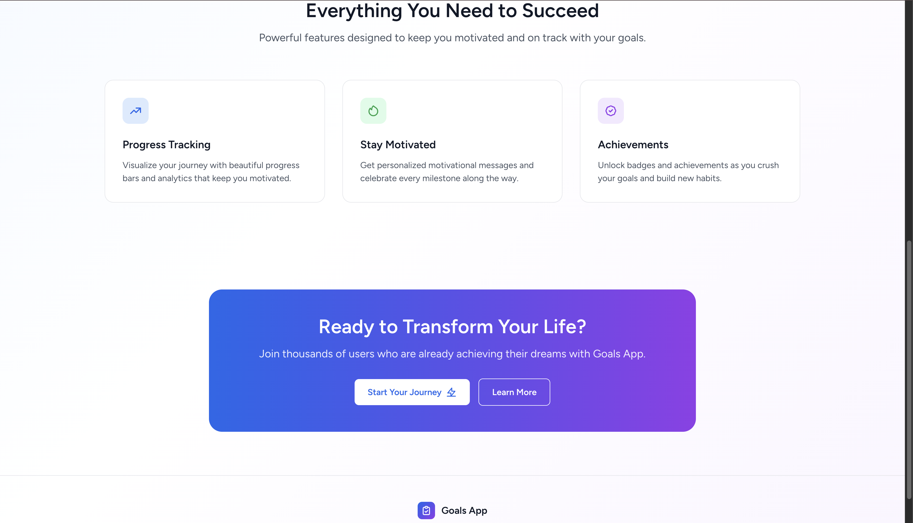

### 🔐 **Autenticación**
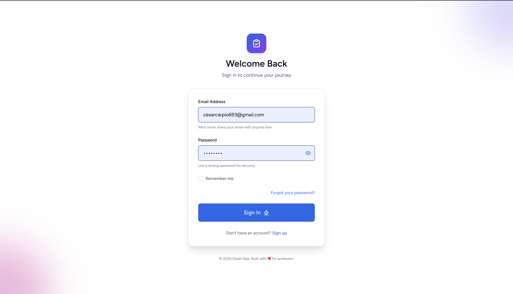
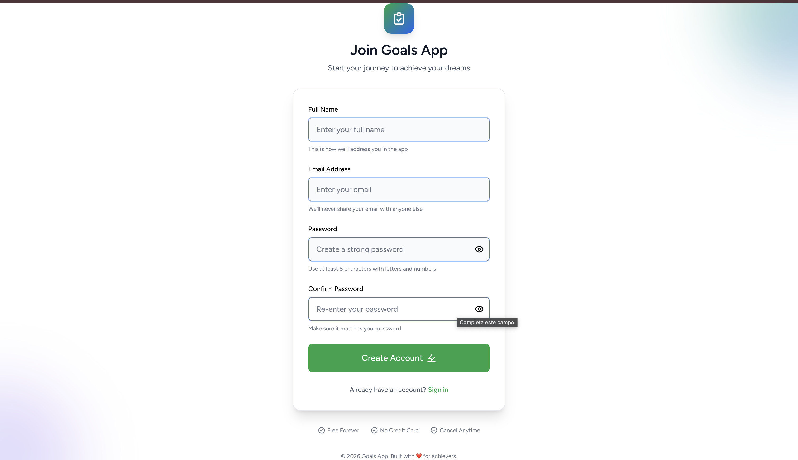
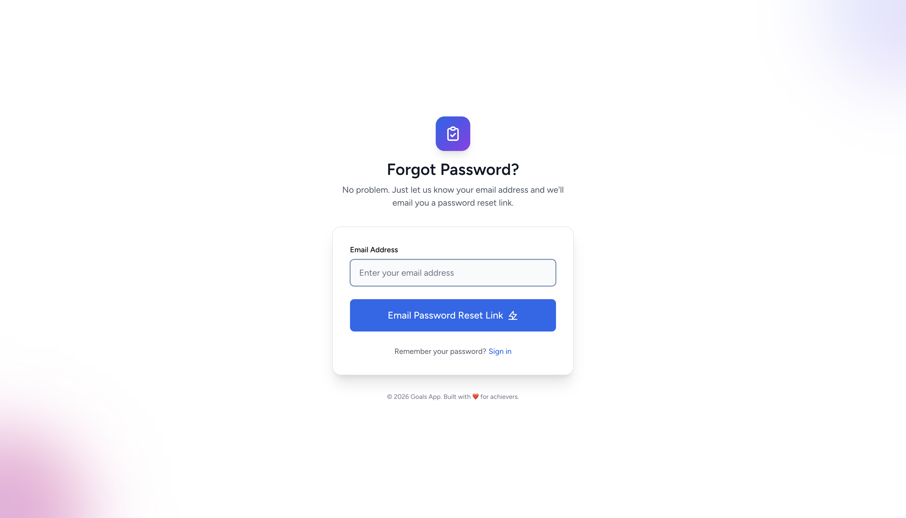

### 📊 **Dashboard Principal**
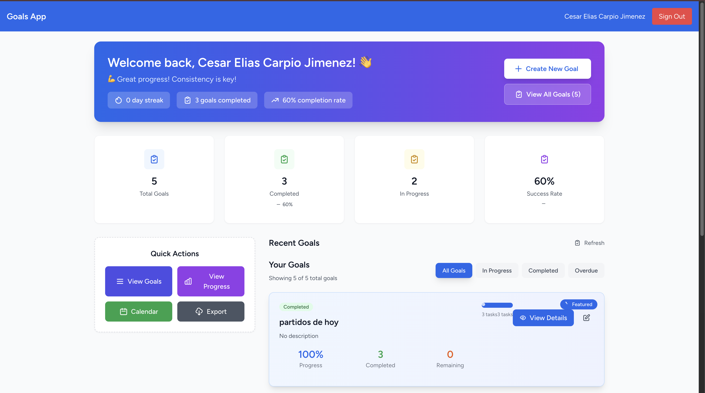
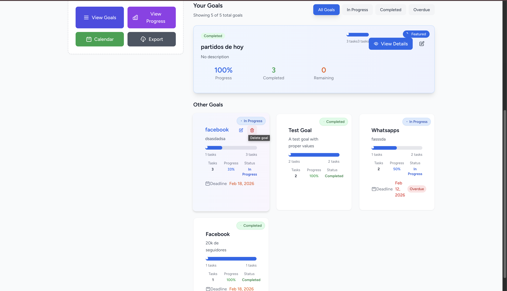

### 🎯 **Gestión de Metas**
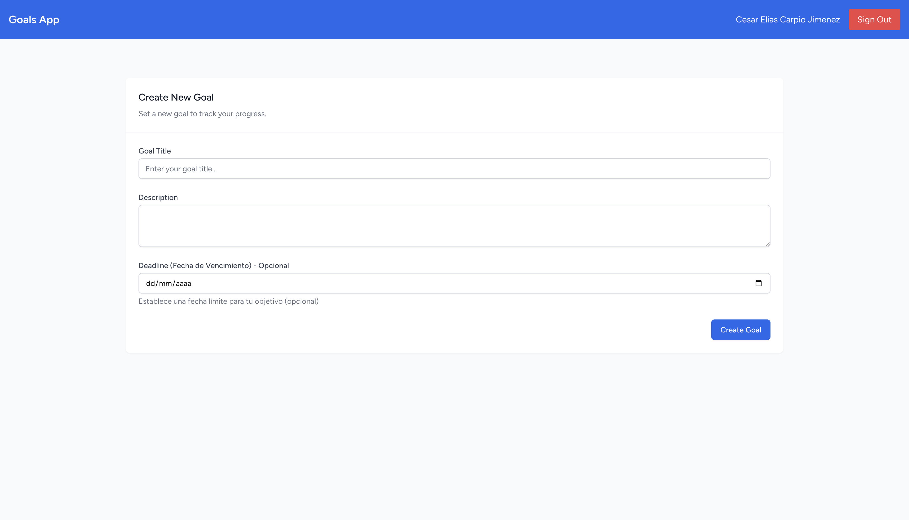
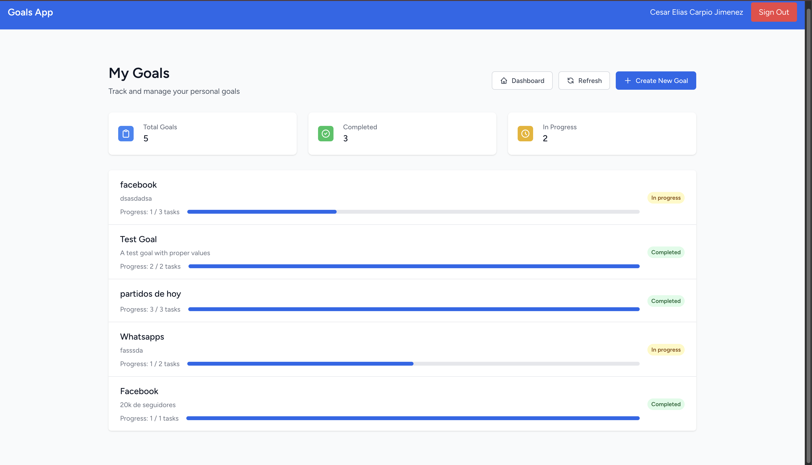
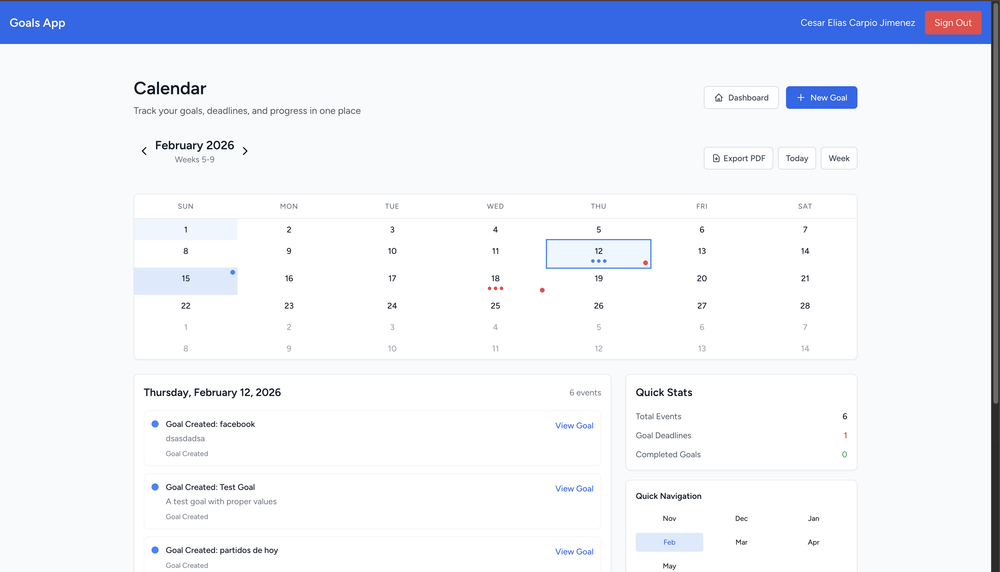

### 📈 **Progreso**
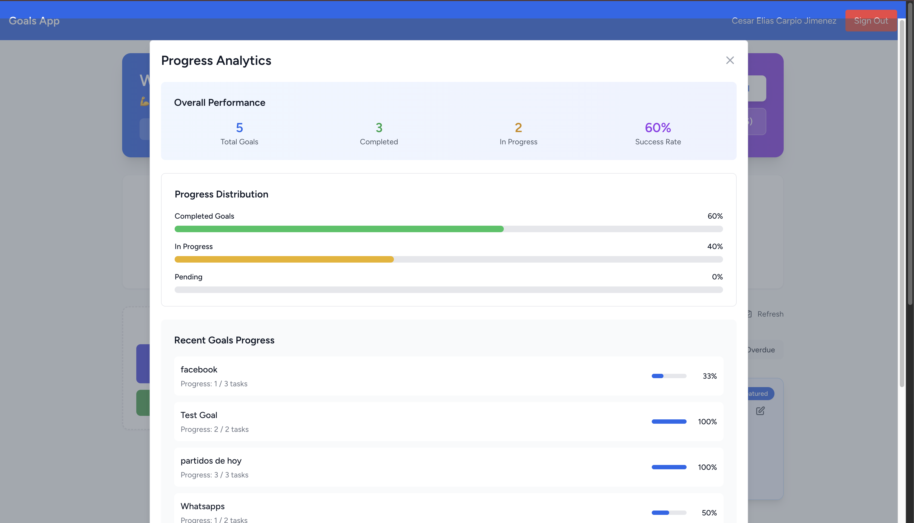

### 📄 **Exportación PDF**
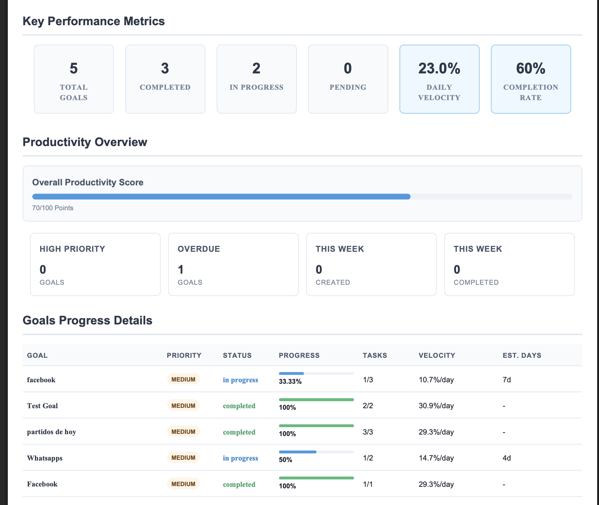
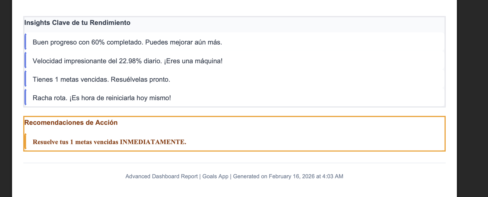

---

**🎯 ¡Desarrollado con ❤️ para ayudarte a alcanzar tus metas!**
